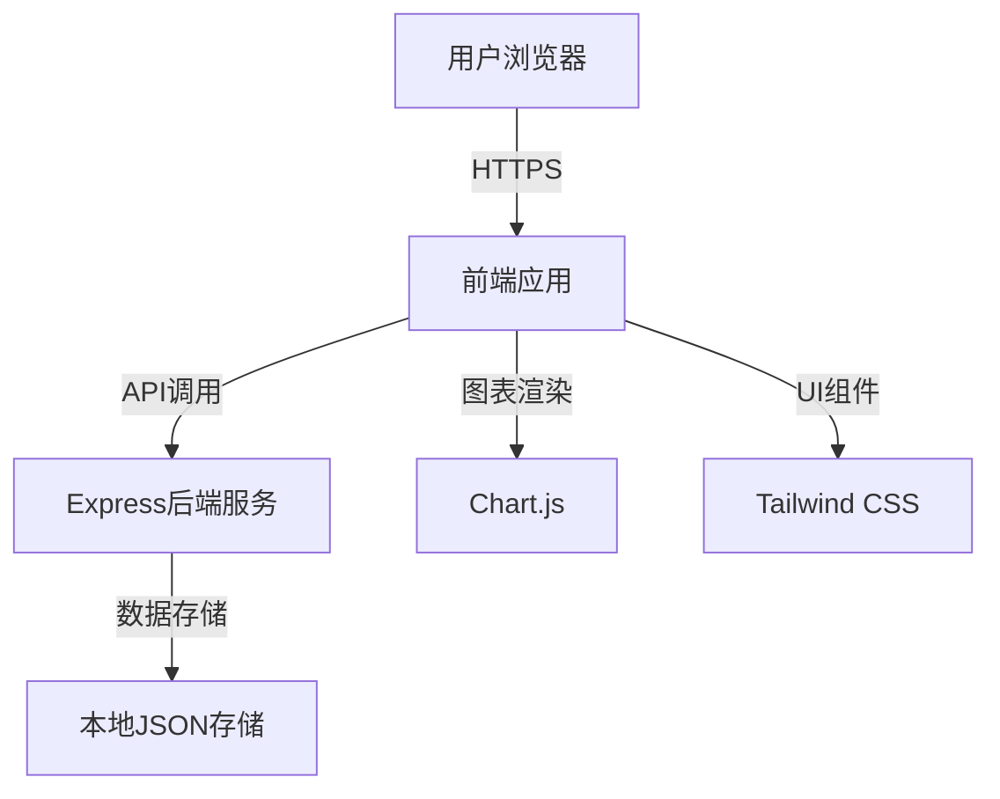
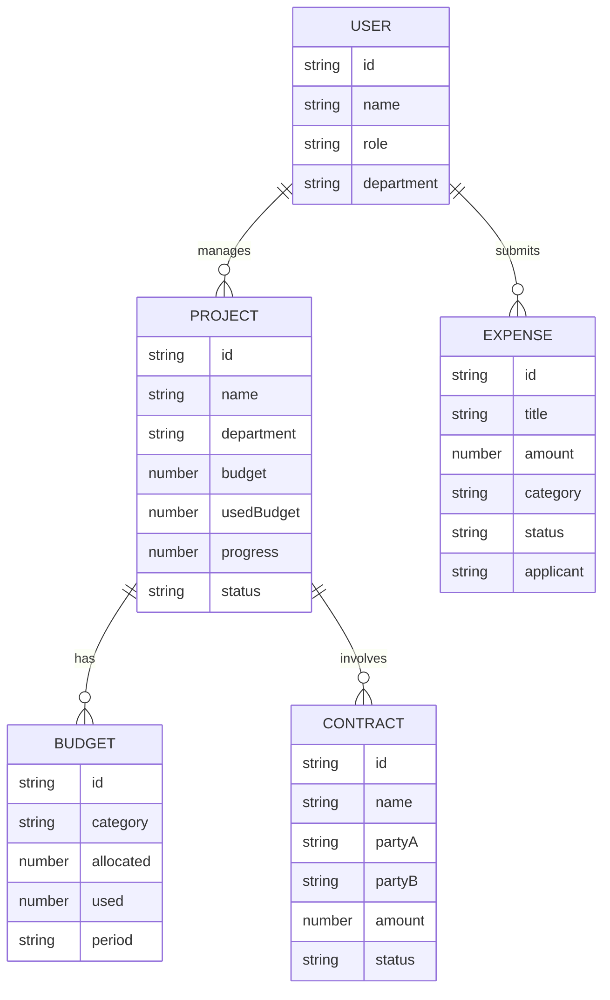

## 1. 架构设计


## 2. 技术描述
- 前端：React@18 + TypeScript + Tailwind CSS@3 + Vite
- 初始化工具：vite-init
- 后端：Express@4 + TypeScript
- 数据存储：本地JSON文件（模拟数据库）
- 图表库：Chart.js + react-chartjs-2
- 状态管理：Zustand
- 路由：React Router v6

## 3. 路由定义
| 路由 | 用途 |
|------|------|
| / | 系统门户首页 |
| /portal | 系统门户 |
| /internal-control | 单位层面内控控制 |
| /risk-management | 风险管理 |
| /budget-management | 预算管理 |
| /income-management | 收入管理 |
| /expense-management | 支出管理 |
| /procurement-management | 采购管理 |
| /asset-management | 资产管理 |
| /project-management | 项目管理 |
| /performance-management | 绩效管理 |
| /contract-management | 合同管理 |
| /bi-reports | BI报表决策分析 |
| /mobile-app | 内控移动应用 |

## 4. API 定义
```typescript
// 通用响应类型
interface ApiResponse<T> {
  success: boolean;
  data: T;
  message?: string;
}

// 统计数据类型
interface DashboardStats {
  pendingTasks: number;
  budgetUsed: number;
  projectsActive: number;
  contractsActive: number;
}

// 项目类型
interface Project {
  id: string;
  name: string;
  department: string;
  budget: number;
  usedBudget: number;
  progress: number;
  status: 'planning' | 'active' | 'completed';
  startDate: string;
  endDate: string;
}

// 预算类型
interface Budget {
  id: string;
  category: string;
  allocated: number;
  used: number;
  remaining: number;
  period: string;
}

// 合同类型
interface Contract {
  id: string;
  name: string;
  partyA: string;
  partyB: string;
  amount: number;
  startDate: string;
  endDate: string;
  status: 'draft' | 'active' | 'expired';
}

// 支出类型
interface Expense {
  id: string;
  title: string;
  amount: number;
  category: string;
  date: string;
  status: 'pending' | 'approved' | 'rejected';
  applicant: string;
}
```

## 5. 服务架构图


## 6. 数据模型
### 6.1 数据模型定义


### 6.2 数据结构
```typescript
// 数据文件结构
interface DataStore {
  users: User[];
  projects: Project[];
  budgets: Budget[];
  contracts: Contract[];
  expenses: Expense[];
}

// 初始化数据
const initialData: DataStore = {
  users: [
    { id: '1', name: '张三', role: 'admin', department: '办公室' },
    { id: '2', name: '李四', role: 'manager', department: '财务部' },
    { id: '3', name: '王五', role: 'staff', department: '业务部' },
  ],
  projects: [
    { id: '1', name: '信息化建设项目', department: '信息中心', budget: 500000, usedBudget: 350000, progress: 70, status: 'active', startDate: '2024-01-01', endDate: '2024-12-31' },
  ],
  budgets: [
    { id: '1', category: '办公费用', allocated: 100000, used: 65000, remaining: 35000, period: '2024年度' },
  ],
  contracts: [
    { id: '1', name: '软件开发服务合同', partyA: '本单位', partyB: '科技公司', amount: 300000, startDate: '2024-01-01', endDate: '2024-06-30', status: 'active' },
  ],
  expenses: [
    { id: '1', title: '办公用品采购', amount: 2500, category: '办公费', date: '2024-05-15', status: 'approved', applicant: '张三' },
  ],
};
```
